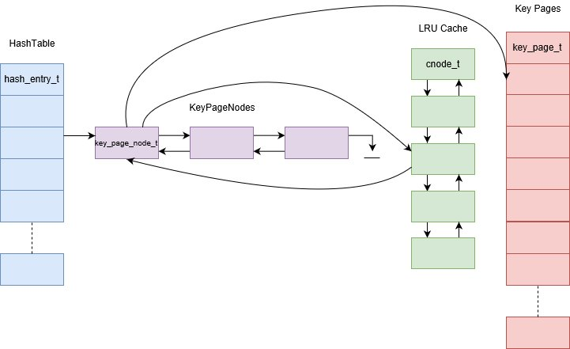

# librdb

Librdb is a simple embeddable database library used to manage millions of key-value pairs. Librdb is thread-safe. Multiple databases can be managed in a single-process. The maximum size of the key and value are 48 and 192 bytes respectively.

### Why another one?

We already have dbm, ndbm, sdbm, qdbm, tokyo cabinet, kyoto cabinet, Berkeley DB, level DB, rock DB. What is need for another one? The reason is simplicity because of the limits imposed on key and value sizes, better control over interfaces (tuned for my needs), and of coarse opportunity to learn.

### Architecture



There are 4 database files per database:

1. *`dbname.db`* Contains key/value pair. Look at `value_page_t`. This file has one or more value pages.
2. *`dbname.fdp`* Contains free disk pages (free blocks in *dbname.db* file) maintained as a stack.
3. *`dbname.idx`* Contains key pages. Look at `key_page_t`. This file has one or more key pages. There is no corresponding *`.fdp`* file as the free disk pages stack is build completely at startup.
4. *`dbname.attr`* Contains the hash table and key page size.

Hash table and key pages are contiguous chunk of memory allocated at start-up, their sizes are configurable. Each hash table entry points to a doubly linked list of key page nodes. The key page node points to the actual key page, and a cached node. The cached node, inturns, point to the key page node. The cached nodes are arranged in a LRU order. The key pages are allocated and referenced via the cached nodes. When the key pages are allocated or touched, the cached nodes move to the top of the list and the least recently ones fall to the bottom of the list. When the system runs out of key pages, the pages at the bottom of the LRU cache are moved out and new pages are read in.

Each key page consists of a 64-bytes header followed by N key records arranged in an array based balanced binary tree. Because there is a limit on the key size, it is possible to build array based binary tree. Each key record points to the disk offset where the actual key/value resides. Each key record is 64-bytes long.

Let's take the following scenario:

1. We need to store 1 billion key/value pairs.
2. The key page is 4096-bytes long.
3. The hash table has 5 million entries.

Assuming fair hash distribution, there will be (1024 * 1024 * 1024) / (5 * 1024 * 1024) i.e. roughly 205 records per hash entry or we will need roughly 4 key pages per hash entry (4 key pages can hold 252 entries). And because all the keys are stored in a page as a balanced tree, we can find a key in a page in 6 searches and in the entire hash entry in 4 * 6 i.e. 24 searches.

So theoretically, we will need one hash lookup and 24 searches to find a key in the database. But in reality, the hash distribution may not be ideal, there will be limitations on memory availability, there will be delays involved in loading pages in memory, writing pages to disk, and other system delays. Still this simple design can perform very well in most scenarios.

### Library interface

#### Constructor

Look at `include/rdb/rdb.h` for reference.

```C++
Rdb(const std::string &dbPath, const std::string &dbName);
Rdb(const std::string &dbPath, const std::string &dbName, const RdbOptions &opt);
Rdb(const std::string &dbPath, const std::string &dbName, int kpsize, int htsize);
Rdb(const std::string &dbPath, const std::string &dbName, int kpsize, int htsize, const RdbOptions &opt);
```

There are 5 configuration options:

1. Key page size. Default is 4096.
2. Hash table size. Default is 50,000.
3. Memory usage. Percentage of memory to use for key pages. Default is 75%.
4. Sync data file after every write. Default is true.
5. Sync index file after every write. Default is false.

Key page and hash table size must be set before the first open. Once the database is opened, these values are *almost* set in stone. If you specify a different value on subsequent opens, the values are simply ignored. There is a way to change them. See `rebuild` below. The set the last three options, use `RdbOptions`.

```C++
int Rdb::open();
```

Opens the database. When the database is opened for the first time, the key page size and the
hash table size are persisted in *`dbname.attr`* file. Subsequent opens use the values stored in
the file.

```C++
int Rdb::get(const char *key, int klen, char *value, int *vlen);
```

Get the *value* for the *key* from the database. *vlen*, on input specifies the maximum *value* buffer length and on successful return contains the actual *value* length.

```C++

class Updater
{
public:
	virtual int update(const char *oval, int olen) = 0;
	virtual int getUpdatedValue(char *nval, int *nlen) = 0;
};

int Rdb::set(const char *key, int klen, const char *value, int vlen, Updater *updater = 0);
```

Sets the *value* for the *key* in the database. This function is also used to updated the value in the database.

Key Exists in DB | updater  | Behaviour
-----------------|----------|--------------------------------------
No               | NULL     | The key/value pair is added to the database.
Yes              | NULL     | The value for the key is overwritten.
No               | Not-NULL | The key/value pair is added to the database. *updater* is ignored.
Yes              | Not-NULL | The current value of the key is passed in to *updater::update* method. The value returned by *updater::getUpdatedValue* is persisted in the database.

```C++
int Rdb::remove(const char *key, int klen);
```

Removes the *key* from the database.

```C++
int Rdb::rebuild()
```

Rebuilds the database. You can use this for two purposes:
1. Defragmenting the database.
2. Resetting the key page size and the hash table size.

The database must not be in use for this operation.

```C++
int Rdb::close()
```

Closes the database.

### rdbdrvr

`rdbdrvr` is a simple driver of this library. This code and the test code could be used as an example for the librdb usage.
